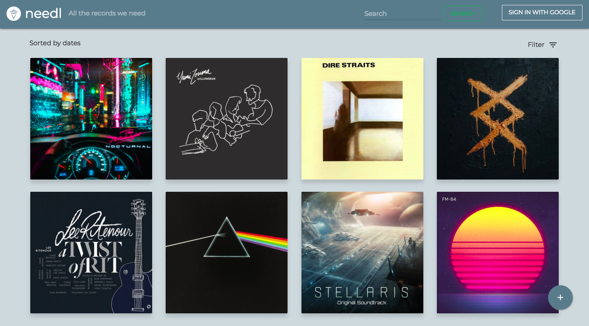

# needl

## Our Goal

Do you wish for plenty of records to be pressed on vinyl ? If yes, **needl** is the place for you !
 <br />
 **needl** is a web app that helps vinyl collectors share their wishes with others. The only rule is that records showcased on **needl** mustn't have been already widely pressed. <br/>
 On **needl**, you can submit any records you wish were pressed and also back the records submitted by others.<br/>
 ```diff
 -Note that this is still a work in progress and design choices are always subjected to change.
 ```


## Home Page

The home page of **needl** is where you'll access all of the vinyls that were submitted.<br />
<br />
 <br />
<br />
You can directly access the album and artist names of the vinyl without actually having to click on it. Just hover your mouse over the album covers.<br />
<br />

<br />
<br />
We've also added filters to display certain types of vinyls (by date and number of votes).<br />
<br />
<br />
<br />
```diff
-A full text search function is being worked on
```
## Login

To submit or edit vinyls and also comment you will need to log into **needl**. This is done via Google authentication, so a Google account is required. <br />
To actually log in, just click on the  *Sign in with Google*  located in the top bar. Note that if you try to submit a vinyl or comment while not logged in you will be redirected to the Google authentication page.<br />
<br />
 <br />
<br />
While logged in you can access your profile or sign out by clicking on your name or picture.<br />
<br />
 <br />
<br />

## Submit a Vinyl
To submit a vinyl, you only have to click on the "plus" button displayed at all time on the home page. After clicking, you'll land on this page : <br />
<br />
 <br />
<br />
Here you will have to fill in the informations of the records you want to submit. We've even added a preview of the album cover you'll choose ! <br />
Note that only the description is optional. The rest of the infos are mandatory for obvious reasons. <br />
From there, you only have to click on submit.

## Access a Vinyl
Right after you created your vinyl or when clicking on one from the home page, you will access its own page.<br />
<br />
 <br />
<br />
Here you are able to back this vinyl (meaning you want it pressed too) by clicking on the **NEED** button. Once you click on it you're able to change your mind but clicking the **NEVERMIND** button.<br />
<br />
 <br />
<br />
If you'd like to edit the description in your vinyl, you can do that too. <br />
<br />
 <br />
<br />
You can also comment on this vinyl right below. Comments now have nested replies. <br />
<br />
 <br />
<br />
Here's how submitting a reply actually looks.<br />
<br />
 <br />
<br />
Submitting a comment has a dynamic field so you don't send an empty comment accidentally. <br />
<br />
 <br />
<br />


## Profile Page
```diff
-The profile page is WIP but coming very soon !
```
