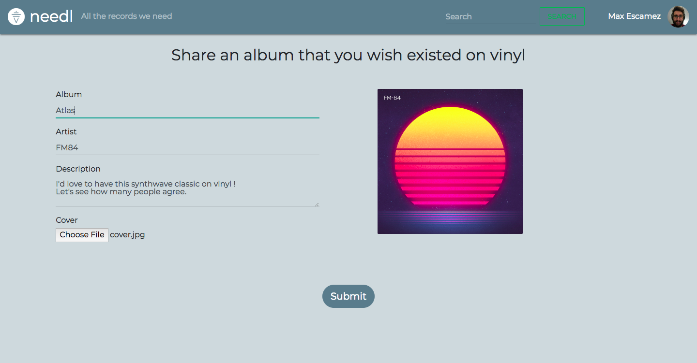

# needl

## Our Goal

Do you wish for thousands of records to be pressed on vinyl ? If yes, needl is the place for you !
 <br />
 needl is a web app that helps vinyl collectors share their wishes with others. The only rule is that records showcased on needl mustn't have been already widely pressed. <br/>
 On needl, you can submit any records you wish were pressed and also back the records submitted by others.<br/>
 ```diff
 -Note that this is still a work in progress and design choices are always subjected to change.
 ```


## Home Page

The home page of needl is where you'll access all of the vinyls that were submitted. Right now, it looks like this, but this is subject to change :<br />
<br />
 <br />
<br />
You can directly access the album and artist names of the vinyl without actually having to click on it. Just hover your mouse over the album covers.<br />
<br />

<br />
<br />
```diff
-Later on, we'll add filters to display only certain types of vinyls and also a search function. This is coming very soon !
```
## Login

To submit or edit vinyls and also comment you will need to log into needl. This is done via Google authentication, so you'll need a Google account. <br />
To actually log in, just click on the "Sign in with Google" located in the top bar. Note that if you try to submit a vinyl or comment while not logged in you will be redirected to the Google authentication page.<br />
<br />
 <br />
<br />
While logged in you can access your profile or sign out by clicking on the down arrow.<br />
<br />
 <br />
<br />

## Submit a Vinyl
To submit a vinyl, you only have to click on the "plus" button displayed at all time on the home page. After clicking, you'll land on this page : <br />
<br />
 <br />
<br />
Here you will have to fill in the informations of the records you want to submit. We've even added a preview of the album cover you'll choose ! <br />
Note that only the description is optional. The rest of the infos are mandatory for obvious reasons. <br />
From there, you only have to click on submit.

## Access a Vinyl
Right after you created your vinyl or when clicking on one from the home page, you will access its own page.<br />
<br />
 <br />
<br />
Here you will be able to back this vinyl (meaning you want it pressed too).
You can also comment on this vinyl right below.
```diff
-Comments will also have replies. Right now this is WOP.
```


## Profile Page
```diff
-This is completely WOP, but basically you will be able to access the vinyls you submitted and the ones you backed.
```
